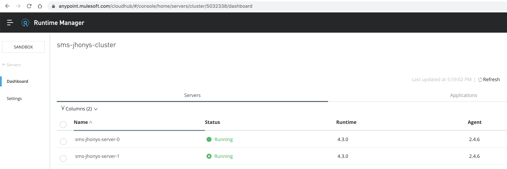
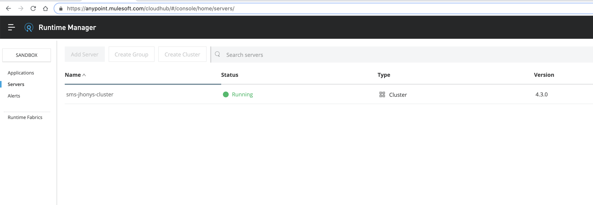
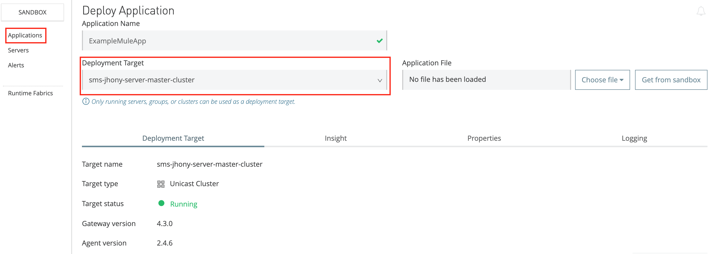
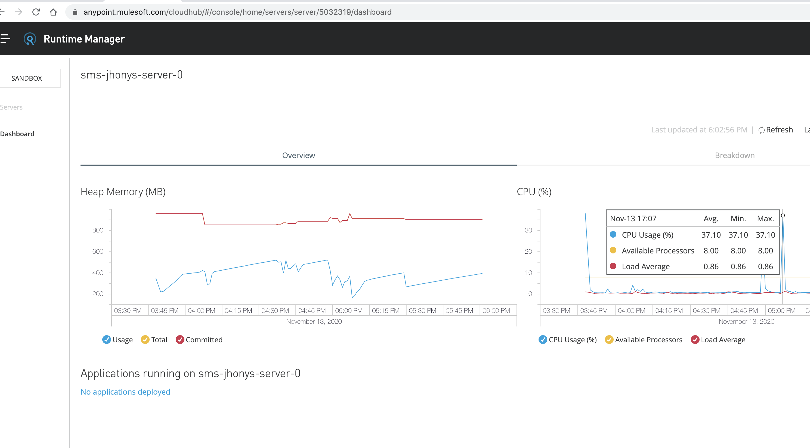
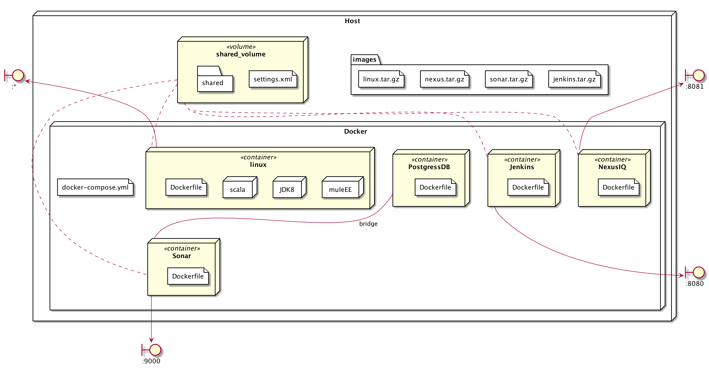

# 🐳🐳 D2D-DOCKERS 🐳🐳

#### Requirements 
Set up Docker and docker-compose

[Download Docker Desktop for Mac](https://www.docker.com/get-started) 

[Install docker-compose with Homebrew](https://formulae.brew.sh/formula/docker-compose)

#### Mule Standalone 
Run steps: 
1. `sh ./create-dirs.sh`
2. `cp .env.example .env`
3. `docker-compose up -d [SERVICE_NAME]`

Shutdown steps:
1. `docker-compose down [SERVICE_NAME]`

### Cluster mode using Runtime Manager?

1. Go to Anypoint Plarform -> Runtime Manager -> Servers -> Add Server
Copy the following token and server name:
`./amc_setup -H (TOKEN) (SERVER_NAME)`

And add it to .env
```
MULE_SERVER_TOKEN=(TOKEN)
MULE_SERVER_ID=(SERVER_NAME)
```

Run:
1. `docker-compose -f docker-compose-cluster.yml up -d`
2. Go to Runtime Manager and check dashboard, you should see the servers up and running
3. Create Cluster (Add name you want: example: b2b-devops-training-cluster)
    Unicast
    IP: Use the one that shows up (should appear automatically)
    Port: Autodiscovery (default 5701)
4. Deploy an application (screenshot): export Mule App .jar deployable
5. Test locally: 
```
curl -X GET 1 http://0.0.0.0:5050/834test -v
curl -X POST SERVER:PORT/ENDPOINT -d '{"tag0":value, "tag1": "value", "tag3": "value"}' -v
```         

#### Extra Material
[Drive DevOps Toolbox - Restricted][https://drive.google.com/drive/u/0/folders/1vjK5aASXmOSOoKPTs8bdDj6LUwc_Yc1o]

### Runtime Manager









### Troubleshooting
1. Error: token no valid: Please take into account that the above token can expirate after some time, generate again on Runtime Manager.
2. Runtime server already exists: 
```
docker-compose -f docker-compose-cluster.yml down
``` 

### Useful commands
```
docker-compose up --build (every time we do some changes on the image)
docker-compose up -d
docker-compose down
docker-compose ps ---> To see the apps running
docker-compose up --remove-orphans
docker inspect [CONTAINER] / docker inspect <container id> | grep "IPAddress" ---> Check raw container info
docker exec -it [CONTAINER HASH / TAG] bash ---> To get inside the container
docker cp file/folder [CONTAINER_ID]:[FOLDER_INSIDE_CONTAINER / example: ]docker cp ~/MY_LOCAL_FILE.zip 350a486dcd7e:/opt/centos         
```

### TODO
- [ ] Use replicas to determine number of nodes on docker-compose-cluster.yml. (WIP)
- [ ] Explore create cluster manually by copying mule-cluster.properties from existent nodes into new containers.


=====================================================================================
CI/CD SECTION
=====================================================================================
### Jenkins
[http://localhost:8080](http://localhost:8080)

### Nexus 3
[http://localhost:8081](http://localhost:8081)


To sign in, get inside containers, and use user: admin and password: value inside container/nexus-data/admin.password
```
docker exec -it nexus bash                                                                                                                       ✔ │ base Py 
nexus-data/
cat admin.password 
ed66ab4d-2c0e-4784-8269-d315178efba2bash 
```

### PostgreSQL
http://localhost:5432

### SonarQube
[http://localhost:9000](http://localhost:9000)
```
User: admin
Pass: admin
```

### Architecture

